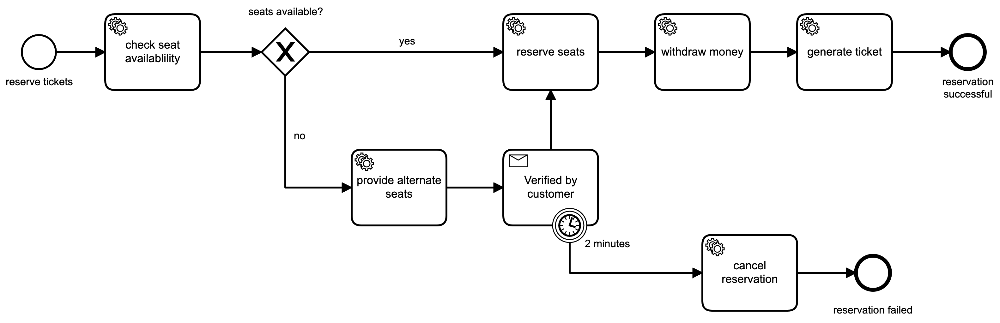

## BPMN Cinema
Camunda Cinema Cloud is a showcase for the Camunda Cloud platform

### Engines
- Zeebe 1.1.0

### Techniques
- Zeebe Workers in Springboot
- BPMN
    - Messages
    - Errors
    - Timer
    - Gateways

## Process Model

## How to run it
- generate a client configuration on you Camunda Cloud account (tab API)
- add your camunda cloud cluster credentials to the `src/main/resources/application.yml`
- start the application
    - run `./gradlew bootRun` from your terminal
    - use your IDE to start the application
- use a REST client to make a reservation:
    - endpoint `localhost:8087/reservation`
    - POST request
        - body: `{ "userId":"max.mustermann", "seats": [ "A1", "A2" ] }`
        - content-type: `application/json`
        - no auth necessary
- check the log output
- in case alternative seats are offered you can check Operate for the current running instance
