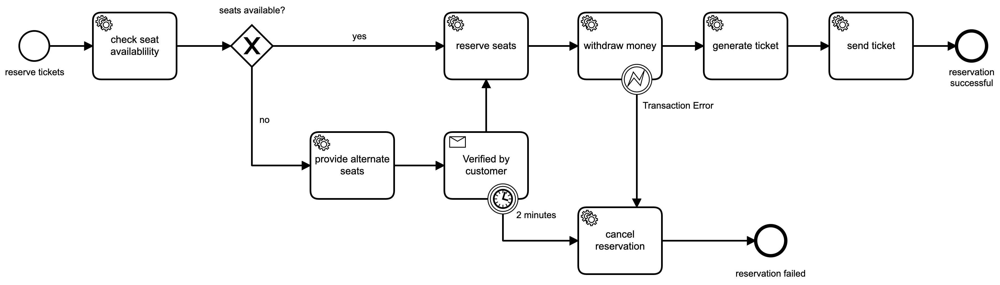

## Camunda Platform 8 Cinema
Camunda Platform 8 Cinema is a showcase for the Camunda platform 8 where one can reserve tickets for an imaginary cinema

### Engines
- Camunda Platform 8 (Zeebe 8.2.x)
- Springboot 3.x

### Techniques
- Job Workers in Springboot
- BPMN
    - Messages
    - Errors
    - Timer
    - Gateways

## Process Model

## How to run it
- generate a client configuration on your Camunda Platform account (tab API)
- add your camunda cloud cluster credentials to the `src/main/resources/application.yml`
- OR: use the local container environment (docker/docker-compose-core.yaml)
- start the application
    - run `./gradlew bootRun` from your terminal
    - use your IDE to start the application
- use a REST client to make a reservation:
    - endpoint `localhost:8087/reservation`
    - POST request
        - body: `{ "name":"Max Mustermann", "seats": [ "A1", "A2" ] }`
        - content-type: `application/json`
        - no auth necessary
- check the log output
- OR: open (local) Operate instance (localhost:8081 user/pw: demo:demo)
- alternative seats are offered in the log output of your IDE in form of an URL
- in case alternative seats are offered you can also check Operate for the current running instance
